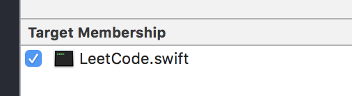

# LeetCode.swift

Solutions to LeetCode by Swift.

## Tags Abbreviated description

- **A** : `Array`
- **DP** : `Dynamic Programming`
- **Str** : `String`
- **M** : `Math`
- **T** : `Tree`
- **HT** : `Hash Table`
- **DFS** : `Depth-first Search`
- **BFS** : `Breadth-first Search`
- **BS** : `Binary Search`
- **TP** : `Two Pointers`
- **B** : `Backtracking`
- **LL** : `Linked List`
- **D&C** : `Divide and Conquer`
- **H** : `Heap`
- **S** : `Sort`
- **G** : `Greedy`
- **BM** : `Bit Manipulation`
- **St** : `Stack`
- **Q** : `Queue`
- **D** : `Design`

## How to debug

The `main.swift` is to initialized **Solution.func(val)**, then you can debug. **Be sure when you initialize the Solution's swift file has chosen Target Membership, like the following image. And once time you just choose one Solution's swift file!**

## Solution Analysis

You can find all solution analysis in my blog [LeetCode OJ](http://yeziahehe.com/leetcode/), and the analysis  to each problem is in the mext table `blog`.

## Problems

| # | Title | Solution | Difficulty | Tags | Blog |
| --- | --- | --- | --- | --- | --- |
| 1 | [Two Sum](https://leetcode.com/problems/two-sum/description/) | [Solution](https://github.com/yeziahehe/LeetCode.swift/blob/master/LeetCode.swift/Solution/001_TwoSum/TwoSum.swift) |  | **`A`** **`HT`** | [blog](http://yeziahehe.com/2017/10/09/TwoSum/) |
| 2 | [Add Two Numbers](https://leetcode.com/problems/add-two-numbers/description/) | [Solution](https://github.com/yeziahehe/LeetCode.swift/blob/master/LeetCode.swift/Solution/002_AddTwoNumbers/AddTwoNumbers.swift) |  | **`LL`** **`M`** | [blog](http://yeziahehe.com/2017/10/10/AddTwoNumbers/) |
| 3 | [Longest Substring Without Repeating Characters](https://leetcode.com/problems/longest-substring-without-repeating-characters/description/) | [Solution](https://github.com/yeziahehe/LeetCode.swift/blob/master/LeetCode.swift/Solution/003_LongestSubstringWithoutRepeatingCharacters/LongestSubstringWithoutRepeatingCharacters.swift) |  | **`HT`** **`TP`** **`Str`**| [blog](http://yeziahehe.com/2017/10/11/LongestSubstringWithoutRepeatingCharacters/) |
| 4 | [Median of Two Sorted Arrays](https://leetcode.com/problems/median-of-two-sorted-arrays/description/) | [Solution](https://github.com/yeziahehe/LeetCode.swift/blob/master/LeetCode.swift/Solution/004_MedianOfTwoSortedArrays/MedianOfTwoSortedArrays.swift) |  | **`A`** **`BS`** **`D&C`**| - |
| 12 | [Integer to Roman](https://leetcode.com/problems/integer-to-roman/description/) | [Solution](https://github.com/yeziahehe/LeetCode.swift/blob/master/LeetCode.swift/Solution/012_IntegerToRoman/IntegerToRoman.swift) |  | **`M`** **`A`**| [blog](http://yeziahehe.com/2017/11/12/IntegerToRoman/) |
| 13 | [Roman to Integer](https://leetcode.com/problems/roman-to-integer/description/) | [Solution](https://github.com/yeziahehe/LeetCode.swift/blob/master/LeetCode.swift/Solution/013_RomanToInteger/RomanToInteger.swift) |  | **`M`** **`A`**| [blog](http://yeziahehe.com/2017/11/14/RomanToInteger/) |
| 14 | [Longest Common Prefix](https://leetcode.com/problems/longest-common-prefix/) | [Solution](https://github.com/yeziahehe/LeetCode.swift/blob/master/LeetCode.swift/Solution/014_LongestCommonPrefix/LongestCommonPrefix.swift) |  | **`Str`** | [blog](http://yeziahehe.com/2020/03/07/LongestCommonPrefix/) |
| 19 | [Remove Nth Node From End of List](https://leetcode.com/problems/remove-nth-node-from-end-of-list/) | [Solution](https://github.com/yeziahehe/LeetCode.swift/blob/master/LeetCode.swift/Solution/19_RemoveNthNodeFromEndOfList/RemoveNthNodeFromEndOfList.swift) |  | **`LL`** **`TP`** | [blog](http://yeziahehe.com/2020/03/12/RemoveNthNodeFromEndOfList/) |
| 20 | [Valid Parentheses](https://leetcode.com/problems/valid-parentheses/) | [Solution](https://github.com/yeziahehe/LeetCode.swift/blob/master/LeetCode.swift/Solution/020_ValidParentheses/ValidParentheses.swift) |  | **`St`** **`Str`** | [blog](http://yeziahehe.com/2020/04/04/ValidParentheses/) |
| 21 | [Merge Two Sorted Lists](https://leetcode.com/problems/merge-two-sorted-lists/description/) | [Solution](https://github.com/yeziahehe/LeetCode.swift/blob/master/LeetCode.swift/Solution/021_MergeTwoSortedLists/MergeTwoSortedLists.swift) |  | **`LL`** | [blog](http://yeziahehe.com/2017/11/11/MergeTwoSortedLists/) |
| 26 | [Remove Duplicates from Sorted Array](https://leetcode.com/problems/remove-duplicates-from-sorted-array/) | [Solution](https://github.com/yeziahehe/LeetCode.swift/blob/master/LeetCode.swift/Solution/026_RemoveDuplicatesFromSortedArray/RemoveDuplicatesFromSortedArray.swift) |  | **`A`** **`TP`** | [blog](http://yeziahehe.com/2020/03/08/RemoveDuplicatesFromSortedArray/) |
| 27 | [Remove Element](https://leetcode.com/problems/remove-element/) | [Solution](https://github.com/yeziahehe/LeetCode.swift/blob/master/LeetCode.swift/Solution/027_RemoveElement/RemoveElement.swift) |  | **`A`** **`TP`** | [blog](http://yeziahehe.com/2020/03/08/RemoveElement/) |
| 28 | [Implement strStr()](https://leetcode.com/problems/implement-strstr/description/) | [Solution](https://github.com/yeziahehe/LeetCode.swift/blob/master/LeetCode.swift/Solution/028_ImplementstrStr/ImplementstrStr.swift) |  | **`TP`** **`Str`** | [blog](http://yeziahehe.com/2017/11/18/ImplementstrStr/) |
| 32 | [Longest Valid Parentheses](https://leetcode-cn.com/problems/longest-valid-parentheses/) | [Solution](https://github.com/yeziahehe/LeetCode.swift/blob/master/LeetCode.swift/Solution/032_LongestValidParentheses.swift) |  | **`DP`** **`Str`** | [blog](http://yeziahehe.com/2020/07/14/LongestValidParentheses/) |
| 44 | [Wildcard Matching](https://leetcode-cn.com/problems/wildcard-matching/) | [Solution](https://github.com/yeziahehe/LeetCode.swift/blob/master/LeetCode.swift/Solution/044_WildcardMatching.swift) |  | **`DP`** **`Str`** **`G`** **`B`** | [blog](http://yeziahehe.com/2020/07/14/WildcardMatching/) |
| 50 | [Pow(x, n)](https://leetcode-cn.com/problems/powx-n/) | [Solution](https://github.com/yeziahehe/LeetCode.swift/blob/master/LeetCode.swift/Solution/50_powx-n/powx-n.swift) |  | **`M`** **`BS`** | [blog](http://yeziahehe.com/2020/06/28/powx-n/) |
| 53 | [Maximum Subarray](https://leetcode.com/problems/maximum-subarray/description/) | [Solution](https://github.com/yeziahehe/LeetCode.swift/blob/master/LeetCode.swift/Solution/053_MaximumSubarray/MaximumSubarray.swift) |  | **`A`** **`D&C`** **`DP`** | [blog](http://yeziahehe.com/2017/09/21/MaximumSubArray/) |
| 54 | [Spiral Matrix](https://leetcode.com/problems/spiral-matrix/) | [Solution](https://github.com/yeziahehe/LeetCode.swift/blob/master/LeetCode.swift/Solution/54_SpiralMatrix/SpiralMatrix.swift) |  | **`A`**| [blog](http://yeziahehe.com/2020/03/06/SpiralMatrix/) |
| 61 | [Rotate List](https://leetcode.com/problems/rotate-list/) | [Solution](https://github.com/yeziahehe/LeetCode.swift/blob/master/LeetCode.swift/Solution/61_RotateList/RotateList.swift) |  | **`LL`** **`TP`** | [blog](http://yeziahehe.com/2020/04/03/RotateList/) |
| 63 | [Unique Paths II](https://leetcode-cn.com/problems/unique-paths-ii/) | [Solution](https://github.com/yeziahehe/LeetCode.swift/blob/master/LeetCode.swift/Solution/63_UniquePathsII.swift) |  | **`A`** **`DP`** | [blog](http://yeziahehe.com/2020/07/14/UniquePathsII/) |
| 66 | [Plus One](https://leetcode.com/problems/plus-one/description/) | [Solution](https://github.com/yeziahehe/LeetCode.swift/blob/master/LeetCode.swift/Solution/066_PlusOne/PlusOne.swift) |  | **`A`** **`M`** | [blog](http://yeziahehe.com/2017/11/07/PlusOne/) |
| 67 | [Add Binary](https://leetcode.com/problems/add-binary/) | [Solution](https://github.com/yeziahehe/LeetCode.swift/blob/master/LeetCode.swift/Solution/067_AddBinary/AddBinary.swift) |  | **`Str`** **`M`** | [blog](http://yeziahehe.com/2020/03/07/AddBinary/) |
| 70 | [Climbing Stairs](https://leetcode-cn.com/problems/climbing-stairs/) | [Solution](https://github.com/yeziahehe/LeetCode.swift/blob/master/LeetCode.swift/Solution/070_ClimbingStairs/ClimbingStairs.swift) |  | **`DP`** | [blog](http://yeziahehe.com/2020/06/22/ClimbingStairs/) |
| 79 | [Word Search](https://leetcode-cn.com/problems/word-search/) | [Solution](https://github.com/yeziahehe/LeetCode.swift/blob/master/LeetCode.swift/Solution/79_WordSearch/WordSearch.swift) |  | **`A`** **`B`** | [blog](http://yeziahehe.com/2020/06/26/WordSearch/) |
| 94 | [Binary Tree Inorder Traversal](https://leetcode.com/problems/binary-tree-inorder-traversal/) | [Solution](https://github.com/yeziahehe/LeetCode.swift/blob/master/LeetCode.swift/Solution/94_BinaryTreeInorderTraversal/BinaryTreeInorderTraversal.swift) |  | **`HT`** **`St`** **`T`** | [blog](http://yeziahehe.com/2020/04/10/BinaryTreeInorderTraversal/) |
| 96 | [Unique Binary Search Trees](https://leetcode-cn.com/problems/unique-binary-search-trees/) | [Solution](https://github.com/yeziahehe/LeetCode.swift/blob/master/LeetCode.swift/Solution/96_UniqueBinarySearchTrees.swift) |  | **`T`** **`DP`** | [blog](http://yeziahehe.com/2020/07/15/UniqueBinarySearchTrees/) |
| 101 | [Symmetric Tree](https://leetcode.com/problems/symmetric-tree/) | [Solution](https://github.com/yeziahehe/LeetCode.swift/blob/master/LeetCode.swift/Solution/101_SymmetricTree/SymmetricTree.swift) |  | **`T`** **`DFS`** **`BFS`** | [blog](http://yeziahehe.com/2020/04/12/SymmetricTree/) |
| 102 | [Binary Tree Level Order Traversal](https://leetcode.com/problems/binary-tree-level-order-traversal/) | [Solution](https://github.com/yeziahehe/LeetCode.swift/blob/master/LeetCode.swift/Solution/102_BinaryTreeLevelOrderTraversal/BinaryTreeLevelOrderTraversal.swift) |  | **`T`** **`BFS`** | [blog](http://yeziahehe.com/2020/04/10/BinaryTreeLevelOrderTraversal/) |
| 104 | [Maximum Depth of Binary Tree](https://leetcode.com/problems/maximum-depth-of-binary-tree/) | [Solution](https://github.com/yeziahehe/LeetCode.swift/blob/master/LeetCode.swift/Solution/104_MaximumDepthOfBinaryTree/MaximumDepthOfBinaryTree.swift) |  | **`T`** **`DFS`** | [blog](http://yeziahehe.com/2020/04/12/MaximumDepthOfBinaryTree/) |
| 105 | [Construct Binary Tree from Preorder and Inorder Traversal](https://leetcode.com/problems/construct-binary-tree-from-preorder-and-inorder-traversal/) | [Solution](https://github.com/yeziahehe/LeetCode.swift/blob/master/LeetCode.swift/Solution/106_ConstructBinaryTreeFromPreorderAndInorderTraversal/ConstructBinaryTreeFromPreorderAndInorderTraversal.swift) |  | **`T`** **`DFS`** **`A`** | [blog](http://yeziahehe.com/2020/05/01/ConstructBinaryTreeFromPreorderAndInorderTraversal/) |
| 106 | [Construct Binary Tree from Inorder and Postorder Traversal](https://leetcode.com/problems/construct-binary-tree-from-inorder-and-postorder-traversal/) | [Solution](https://github.com/yeziahehe/LeetCode.swift/blob/master/LeetCode.swift/Solution/106_ConstructBinaryTreeFromInorderAndPostorderTraversal/ConstructBinaryTreeFromInorderAndPostorderTraversal.swift) |  | **`T`** **`DFS`** **`A`** | [blog](http://yeziahehe.com/2020/05/01/ConstructBinaryTreeFromInorderAndPostorderTraversal/) |
| 108 | [Convert Sorted Array to Binary Search Tree](https://leetcode.com/problems/convert-sorted-array-to-binary-search-tree/description/) | [Solution](https://github.com/yeziahehe/LeetCode.swift/blob/master/LeetCode.swift/Solution/108_ConvertSortedArrayToBinarySearchTree/ConvertSortedArrayToBinarySearchTree.swift) |  | **`T`** **`DS`** | [blog](http://yeziahehe.com/2017/11/02/ConvertSortedArrayToBinarySearchTree/) |
| 112 | [Path Sum](https://leetcode.com/problems/path-sum/) | [Solution](https://github.com/yeziahehe/LeetCode.swift/blob/master/LeetCode.swift/Solution/112_PathSum/PathSum.swift) |  | **`T`** **`DFS`** | [blog](http://yeziahehe.com/2020/04/12/PathSum/) |
| 113 | [Path Sum II](https://leetcode-cn.com/problems/path-sum-ii/) | [Solution](https://github.com/yeziahehe/LeetCode.swift/blob/master/LeetCode.swift/Solution/113_PathSumII/PathSumII.swift) |  | **`T`** **`DFS`** | [blog](http://yeziahehe.com/2020/07/01/PathSumII/) |
| 116 | [Populating Next Right Pointers in Each Node](https://leetcode.com/problems/populating-next-right-pointers-in-each-node/) | [Solution](https://github.com/yeziahehe/LeetCode.swift/blob/master/LeetCode.swift/Solution/116_PopulatingNextRightPointersInEachNode/PopulatingNextRightPointersInEachNode.swift) |  | **`T`** **`DFS`** | [blog](http://yeziahehe.com/2020/05/06/PopulatingNextRightPointersInEachNode/) |
| 117 | [Populating Next Right Pointers in Each Node II](https://leetcode.com/problems/populating-next-right-pointers-in-each-node-ii/) | [Solution](https://github.com/yeziahehe/LeetCode.swift/blob/master/LeetCode.swift/Solution/117_PopulatingNextRightPointersInEachNodeII/PopulatingNextRightPointersInEachNodeII.swift) |  | **`T`** **`DFS`** | [blog](http://yeziahehe.com/2020/05/06/PopulatingNextRightPointersInEachNodeII/) |
| 118 | [Pascal's Triangle](https://leetcode.com/problems/pascals-triangle/) | [Solution](https://github.com/yeziahehe/LeetCode.swift/blob/master/LeetCode.swift/Solution/118_Pascal'sTriangle/Pascal'sTriangle.swift) |  | **`A`** |[blog](http://yeziahehe.com/2020/03/07/Pascal'sTriangle/) |
| 119 | [Pascal's Triangle II](https://leetcode.com/problems/pascals-triangle-ii/) | [Solution](https://github.com/yeziahehe/LeetCode.swift/blob/master/LeetCode.swift/Solution/119_Pascal'sTriangleII/Pascal'sTriangleII.swift) |  | **`A`** |[blog](http://yeziahehe.com/2020/03/08/Pascal'sTriangleII/) |
| 120 | [Triangle](https://leetcode-cn.com/problems/triangle/) | [Solution](https://github.com/yeziahehe/LeetCode.swift/blob/master/LeetCode.swift/Solution/120_Triangle.swift) |  | **`A`** **`DP`** |[blog](http://yeziahehe.com/2020/07/14/Triangle/) |
| 138 | [Copy List with Random Pointer](https://leetcode.com/problems/copy-list-with-random-pointer/) | [Solution](https://github.com/yeziahehe/LeetCode.swift/blob/master/LeetCode.swift/Solution/138_CopyListWithRandomPointer/CopyListWithRandomPointer.swift) |  | **`HT`** **`LL`** | [blog](http://yeziahehe.com/2020/04/03/CopyListWithRandomPointer/) |
| 139 | [Word Break](https://leetcode.com/problems/word-break/description/) | [Solution](https://github.com/yeziahehe/LeetCode.swift/blob/master/LeetCode.swift/Solution/139_WordBreak/WordBreak.swift) |  | **`DP`** | [blog](http://yeziahehe.com/2017/10/14/WordBreak/) |
| 140 | [Word Break II](https://leetcode.com/problems/word-break-ii/description/) | [Solution](https://github.com/yeziahehe/LeetCode.swift/blob/master/LeetCode.swift/Solution/140_WordBreakII/WordBreakII.swift) |  | **`DP`** **`B`** | [blog](http://yeziahehe.com/2017/10/15/WordBreakII/) |
| 141 | [Linked List Cycle](https://leetcode.com/problems/linked-list-cycle/) | [Solution](https://github.com/yeziahehe/LeetCode.swift/blob/master/LeetCode.swift/Solution/141_LinkedListCycle/LinkedListCycle.swift) |  | **`LL`** **`TP`** | [blog](http://yeziahehe.com/2020/03/11/LinkedListCycle/) |
| 142 | [Linked List Cycle II](https://leetcode.com/problems/linked-list-cycle-ii/) | [Solution](https://github.com/yeziahehe/LeetCode.swift/blob/master/LeetCode.swift/Solution/142_LinkedListCycleII/LinkedListCycleII.swift) |  | **`LL`** **`TP`** | [blog](http://yeziahehe.com/2020/03/11/LinkedListCycleII/) |
| 144 | [Binary Tree Preorder Traversal](https://leetcode.com/problems/binary-tree-preorder-traversal/) | [Solution](https://github.com/yeziahehe/LeetCode.swift/blob/master/LeetCode.swift/Solution/144_BinaryTreePreorderTraversal/BinaryTreePreorderTraversal.swift) |  | **`St`** **`T`** | [blog](http://yeziahehe.com/2020/04/10/BinaryTreePreorderTraversal/) |
| 145 | [Binary Tree Postorder Traversal](https://leetcode.com/problems/binary-tree-postorder-traversal/) | [Solution](https://github.com/yeziahehe/LeetCode.swift/blob/master/LeetCode.swift/Solution/145_BinaryTreePostorderTraversal/BinaryTreePostorderTraversal.swift) |  | **`St`** **`T`** | [blog](http://yeziahehe.com/2020/04/10/BinaryTreePostorderTraversal/) |
| 150 | [Evaluate Reverse Polish Notation](https://leetcode.com/problems/evaluate-reverse-polish-notation/) | [Solution](https://github.com/yeziahehe/LeetCode.swift/blob/master/LeetCode.swift/Solution/150_EvaluateReversePolishNotation/EvaluateReversePolishNotation.swift) |  | **`St`** | [blog](http://yeziahehe.com/2020/04/05/EvaluateReversePolishNotation/) |
| 151 | [Reverse Words in a String](https://leetcode.com/problems/reverse-words-in-a-string/) | [Solution](https://github.com/yeziahehe/LeetCode.swift/blob/master/LeetCode.swift/Solution/151_ReverseWordsInAString/ReverseWordsInAString.swift) |  | **`Str`** | [blog](http://yeziahehe.com/2020/03/08/ReverseWordsInAString/) |
| 153 | [Find Minimum in Rotated Sorted Array](https://leetcode-cn.com/problems/find-minimum-in-rotated-sorted-array/) | [Solution](https://github.com/yeziahehe/LeetCode.swift/blob/master/LeetCode.swift/Solution/153_FindMinimumInRotatedSortedArray/FindMinimumInRotatedSortedArray.swift) |  | **`A`** **`BS`** | [blog](http://yeziahehe.com/2020/06/22/FindMinimumInRotatedSortedArray/) |
| 154 | [Find Minimum in Rotated Sorted Array II](https://leetcode-cn.com/problems/find-minimum-in-rotated-sorted-array-ii/) | [Solution](https://github.com/yeziahehe/LeetCode.swift/blob/master/LeetCode.swift/Solution/154_FindMinimumInRotatedSortedArrayII/FindMinimumInRotatedSortedArrayII.swift) |  | **`A`** **`BS`** | [blog](http://yeziahehe.com/2020/06/22/FindMinimumInRotatedSortedArrayII/) |
| 155 | [Min Stack](https://leetcode.com/problems/min-stack/) | [Solution](https://github.com/yeziahehe/LeetCode.swift/blob/master/LeetCode.swift/Solution/155_MinStack/MinStack.swift) |  | **`St`** **`D`** | [blog](http://yeziahehe.com/2020/04/04/MinStack/) |
| 160 | [Intersection of Two Linked Lists](https://leetcode.com/problems/intersection-of-two-linked-lists/) | [Solution](https://github.com/yeziahehe/LeetCode.swift/blob/master/LeetCode.swift/Solution/160_IntersectionOfTwoLinkedLists/IntersectionOfTwoLinkedLists.swift) |  | **`LL`** | [blog](http://yeziahehe.com/2020/03/12/IntersectionOfTwoLinkedLists/) |
| 164 | [Maximum Gap](https://leetcode.com/problems/maximum-gap/description/) | [Solution](https://github.com/yeziahehe/LeetCode.swift/blob/master/LeetCode.swift/Solution/164_MaximumGap/MaximumGap.swift) |  | **`S`** | [blog](http://yeziahehe.com/2017/10/16/MaximumGap/) |
| 167 | [Two Sum II - Input array is sorted](https://leetcode.com/problems/two-sum-ii-input-array-is-sorted/) | [Solution](https://github.com/yeziahehe/LeetCode.swift/blob/master/LeetCode.swift/Solution/167_TwoSumII/TwoSumII.swift) |  | **`A`** **`TP`** **`BS`** | [blog](http://yeziahehe.com/2020/03/08/TwoSumII/) |
| 189 | [Rotate Array](https://leetcode.com/problems/rotate-array/) | [Solution](https://github.com/yeziahehe/LeetCode.swift/blob/master/LeetCode.swift/Solution/189_RotateArray/RotateArray.swift) |  | **`A`** | [blog](http://yeziahehe.com/2020/03/08/RotateArray/) |
| 191 | [Number of 1 Bits](https://leetcode-cn.com/problems/number-of-1-bits/) | [Solution](https://github.com/yeziahehe/LeetCode.swift/blob/master/LeetCode.swift/Solution/191_NumberOf1Bits/NumberOf1Bits.swift) |  | **`BM`** | [题解](http://yeziahehe.com/2020/06/28/NumberOf1Bits/) |
| 203 | [Remove Linked List Elements](https://leetcode.com/problems/remove-linked-list-elements/) | [Solution](https://github.com/yeziahehe/LeetCode.swift/blob/master/LeetCode.swift/Solution/203_RemoveLinkedListElements/RemoveLinkedListElements.swift) |  | **`LL`** | [blog](http://yeziahehe.com/2020/03/12/RemoveLinkedListElements/) |
| 206 | [Reverse Linked List](https://leetcode.com/problems/reverse-linked-list/description/) | [Solution](https://github.com/yeziahehe/LeetCode.swift/blob/master/LeetCode.swift/Solution/206_ReverseLinkedList/ReverseLinkedList.swift) |  | **`LL`** | [blog](http://yeziahehe.com/2017/11/06/ReverseLinkedList/) |
| 209 | [Minimum Size Subarray Sum](https://leetcode.com/problems/minimum-size-subarray-sum/) | [Solution](https://github.com/yeziahehe/LeetCode.swift/blob/master/LeetCode.swift/Solution/209_MinimumSizeSubarraySum/MinimumSizeSubarraySum.swift) |  | **`A`** **`TP`** **`BS`** | [blog](http://yeziahehe.com/2020/03/08/MinimumSizeSubarraySum/) |
| 225 | [Implement Stack using Queues](https://leetcode.com/problems/implement-stack-using-queues/) | [Solution](https://github.com/yeziahehe/LeetCode.swift/blob/master/LeetCode.swift/Solution/225_ImplementStackUsingQueues/ImplementStackUsingQueues.swift) |  | **`St`** **`D`** | [blog](http://yeziahehe.com/2020/04/06/ImplementStackUsingQueues/) |
| 226 | [Invert Binary Tree](https://leetcode-cn.com/problems/invert-binary-tree/) | [Solution](https://github.com/yeziahehe/LeetCode.swift/blob/master/LeetCode.swift/Solution/226_InvertBinaryTree/InvertBinaryTree.swift) |  | **`T`** | [blog](http://yeziahehe.com/2020/06/29/InvertBinaryTree/) |
| 236 | [Lowest Common Ancestor of a Binary Tree](https://leetcode.com/problems/lowest-common-ancestor-of-a-binary-tree/) | [Solution](https://github.com/yeziahehe/LeetCode.swift/blob/master/LeetCode.swift/Solution/236_LowestCommonAncestorOfABinaryTree/LowestCommonAncestorOfABinaryTree.swift) |  | **`T`**| [blog](http://yeziahehe.com/2020/05/06/LowestCommonAncestorOfABinaryTree/) |
| 232 | [Implement Queue using Stacks](https://leetcode.com/problems/implement-queue-using-stacks/) | [Solution](https://github.com/yeziahehe/LeetCode.swift/blob/master/LeetCode.swift/Solution/232_ImplementQueueUsingStacks/ImplementQueueUsingStacks.swift) |  | **`St`** **`D`** | [blog](http://yeziahehe.com/2020/04/07/ImplementQueueUsingStacks/) |
| 234 | [Palindrome Linked List](https://leetcode.com/problems/palindrome-linked-list/) | [Solution](https://github.com/yeziahehe/LeetCode.swift/blob/master/LeetCode.swift/Solution/234_PalindromeLinkedList/PalindromeLinkedList.swift) |  | **`LL`** **`TP`** | [blog](http://yeziahehe.com/2020/03/13/PalindromeLinkedList/) |
| 240 | [Search a 2D Matrix II](https://leetcode.com/problems/search-a-2d-matrix-ii/) | [Solution](https://github.com/yeziahehe/LeetCode.swift/blob/master/LeetCode.swift/Solution/240_SearchA2DMatrixII/SearchA2DMatrixII.swift) |  | **`BS`** **`D&C`**| [blog](http://yeziahehe.com/2020/06/22/SearchA2DMatrixII/) |
| 283 | [Move Zeroes](https://leetcode.com/problems/move-zeroes/description/) | [Solution](https://github.com/yeziahehe/LeetCode.swift/blob/master/LeetCode.swift/Solution/283_MoveZeroes/MoveZeroes.swift) |  | **`A`** **`TP`** | [blog](http://yeziahehe.com/2017/10/13/MoveZeroes/) |
| 297 | [Serialize and Deserialize Binary Tree](https://leetcode.com/problems/serialize-and-deserialize-binary-tree/) | [Solution](https://github.com/yeziahehe/LeetCode.swift/blob/master/LeetCode.swift/Solution/297_SerializeAndDeserializeBinaryTree/SerializeAndDeserializeBinaryTree.swift) |  | **`T`** **`D`**| [blog](http://yeziahehe.com/2020/05/06/SerializeAndDeserializeBinaryTree/) |
| 309 | [Best Time to Buy and Sell Stock with Cooldown](https://leetcode-cn.com/problems/best-time-to-buy-and-sell-stock-with-cooldown/) | [Solution](https://github.com/yeziahehe/LeetCode.swift/blob/master/LeetCode.swift/Solution/309_BestTimeToBuyAndSellStockWithCooldown.swift) |  | **`DP`**| [blog](http://yeziahehe.com/2020/07/14/BestTimeToBuyAndSellStockWithCooldown/) |
| 328 | [Odd Even Linked List](https://leetcode.com/problems/odd-even-linked-list/) | [Solution](https://github.com/yeziahehe/LeetCode.swift/blob/master/LeetCode.swift/Solution/328_OddEvenLinkedList/OddEvenLinkedList.swift) |  | **`LL`**| [blog](http://yeziahehe.com/2020/03/13/OddEvenLinkedList/) |
| 343 | [Integer Break](https://leetcode-cn.com/problems/integer-break/) | [Solution](https://github.com/yeziahehe/LeetCode.swift/blob/master/LeetCode.swift/Solution/343_IntegerBreak/IntegerBreak.swift) |  | **`M`** **`DP`** | [blog](http://yeziahehe.com/2020/06/28/IntegerBreak/) |
| 344 | [Reverse String](https://leetcode.com/problems/reverse-string/) | [Solution](https://github.com/yeziahehe/LeetCode.swift/blob/master/LeetCode.swift/Solution/344_ReverseString/ReverseString.swift) |  | **`Str`** **`TP`** | [blog](http://yeziahehe.com/2020/03/07/ReverseString/) |
| 346 | [Moving Average from Data Stream](https://leetcode.com/problems/moving-average-from-data-stream/) | [Solution](https://github.com/yeziahehe/LeetCode.swift/blob/master/LeetCode.swift/Solution/346_MovingAverageFromDataStream/MovingAverageFromDataStream.swift) |  | **`Q`** | [blog](http://yeziahehe.com/2020/03/03/MovingAverageFromDataStream/) |
| 373 | [Find K Pairs with Smallest Sums](https://leetcode.com/problems/find-k-pairs-with-smallest-sums/description/) | [Solution](https://github.com/yeziahehe/LeetCode.swift/blob/master/LeetCode.swift/Solution/373_FindKPairsWithSmallestSums/FindKPairsWithSmallestSums.swift) |  | **`H`** | [blog](http://yeziahehe.com/2017/11/05/FindKPairsWithSmallestSums/) |
| 378 | [Kth Smallest Element in a Sorted Matrix](https://leetcode-cn.com/problems/kth-smallest-element-in-a-sorted-matrix/) | [Solution](https://github.com/yeziahehe/LeetCode.swift/blob/master/LeetCode.swift/Solution/378_KthSmallestElementInASortedMatrix.swift) |  | **`H`** **`BS`** | [blog](http://yeziahehe.com/2020/07/14/KthSmallestElementInASortedMatrix/) |
| 394 | [Decode String](https://leetcode.com/problems/decode-string/) | [Solution](https://github.com/yeziahehe/LeetCode.swift/blob/master/LeetCode.swift/Solution/394_DecodeString/DecodeString.swift) |  | **`St`** **`DFS`** | [blog](http://yeziahehe.com/2020/04/08/DecodeString/) |
| 404 | [Sum of Left Leaves](https://leetcode.com/problems/sum-of-left-leaves/) | [Solution](https://github.com/yeziahehe/LeetCode.swift/blob/master/LeetCode.swift/Solution/404_SumOfLeftLeaves/SumOfLeftLeaves.swift) |  | **`T`** | [blog](http://yeziahehe.com/2020/02/28/SumOfLeftLeaves/) |
| 449 | [Serialize and Deserialize BST](https://leetcode.com/problems/serialize-and-deserialize-bst/) | [Solution](https://github.com/yeziahehe/LeetCode.swift/blob/master/LeetCode.swift/Solution/449_SerializeAndDeserializeBST/SerializeAndDeserializeBST.swift) |  | **`T`**| [blog](http://yeziahehe.com/2020/05/06/SerializeAndDeserializeBST/) |
| 455 | [Assign Cookies](https://leetcode.com/problems/assign-cookies/) | [Solution](https://github.com/yeziahehe/LeetCode.swift/blob/master/LeetCode.swift/Solution/455_AssignCookiese/AssignCookies.swift) |  | **`G`** | [blog](http://yeziahehe.com/2020/02/28/AssignCookies/) |
| 461 | [Hamming Distance](https://leetcode.com/problems/hamming-distance/) | [Solution](https://github.com/yeziahehe/LeetCode.swift/blob/master/LeetCode.swift/Solution/461_HammingDistance/HammingDistance.swift) |  | **`BM`** | [blog](http://yeziahehe.com/2020/02/27/HammingDistance/) |
| 485 | [Max Consecutive Ones](https://leetcode.com/problems/max-consecutive-ones/) | [Solution](https://github.com/yeziahehe/LeetCode.swift/blob/master/LeetCode.swift/Solution/485_MaxConsecutiveOnes/MaxConsecutiveOnes.swift) |  | **`A`** | [blog](http://yeziahehe.com/2020/03/08/MaxConsecutiveOnes/) |
| 498 | [Diagonal Traverse](https://leetcode.com/problems/diagonal-traverse/) | [Solution](https://github.com/yeziahehe/LeetCode.swift/blob/master/LeetCode.swift/Solution/498_DiagonalTraverse/DiagonalTraverse.swift) |  | **`A`**| [blog](http://yeziahehe.com/2020/03/05/DiagonalTraverse/) |
| 509 | [Fibonacci Number](https://leetcode-cn.com/problems/fibonacci-number/) | [Solution](https://github.com/yeziahehe/LeetCode.swift/blob/master/LeetCode.swift/Solution/509_FibonacciNumber/FibonacciNumber.swift) |  | **`A`** | [blog](http://yeziahehe.com/2020/06/22/FibonacciNumber/) |
| 557 | [Reverse Words in a String III](https://leetcode.com/problems/reverse-words-in-a-string-iii/) | [Solution](https://github.com/yeziahehe/LeetCode.swift/blob/master/LeetCode.swift/Solution/557_ReverseWordsInAStringIII/ReverseWordsInAStringIII.swift) |  | **`Str`** | [blog](http://yeziahehe.com/2020/03/08/ReverseWordsInAStringIII/) |
| 561 | [Array Partition I](https://leetcode.com/problems/array-partition-i/) | [Solution](https://github.com/yeziahehe/LeetCode.swift/blob/master/LeetCode.swift/Solution/561_ArrayPartitionI/ArrayPartitionI.swift) |  | **`A`** | [blog](http://yeziahehe.com/2020/03/08/ArrayPartitionI/) |
| 566 | [Reshape the Matrix](https://leetcode.com/problems/reshape-the-matrix) | [Solution](https://github.com/yeziahehe/LeetCode.swift/blob/master/LeetCode.swift/Solution/566_ReshapeTheMatrix/ReshapeTheMatrix.swift) |  | **`A`** | [blog](http://yeziahehe.com/2020/03/02/ReshapeTheMatrix/) |
| 628 | [Maximum Product of Three Numbers](https://leetcode.com/problems/maximum-product-of-three-numbers/description/) | [Solution](https://github.com/yeziahehe/LeetCode.swift/blob/master/LeetCode.swift/Solution/628_MaximumProductOfThreeNumbers/MaximumProductOfThreeNumbers.swift) |  | **`A`** **`M`** | [blog](http://yeziahehe.com/2017/11/03/MaximumProductOfThreeNumbers/) |
| 657 | [Robot Return to Origin](https://leetcode.com/problems/robot-return-to-origin/) | [Solution](https://github.com/yeziahehe/LeetCode.swift/blob/master/LeetCode.swift/Solution/657_RobotReturnToOrigin/RobotReturnToOrigin.swift) |  | **`Str`** | [blog](http://yeziahehe.com/2020/02/27/RobotReturntoOrigin/) |
| 707 | [Design Linked List](https://leetcode.com/problems/design-linked-list/) | [Solution](https://github.com/yeziahehe/LeetCode.swift/blob/master/LeetCode.swift/Solution/707_DesignLinkedList/DesignLinkedList.swift) |  | **`M`** **`LL`** | [blog](http://yeziahehe.com/2020/03/11/DesignLinkedList/) |
| 718 | [Maximum Length of Repeated Subarray](https://leetcode-cn.com/problems/maximum-length-of-repeated-subarray/) | [Solution](https://github.com/yeziahehe/LeetCode.swift/blob/master/LeetCode.swift/Solution/718_MaximumLengthOfRepeatedSubarray.swift) |  | **`A`** **`HT`** **`BS`** **`DP`** | [blog](http://yeziahehe.com/2020/07/14/MaximumLengthOfRepeatedSubarray/) |
| 724 | [Find Pivot Index](https://leetcode.com/problems/find-pivot-index/) | [Solution](https://github.com/yeziahehe/LeetCode.swift/blob/master/LeetCode.swift/Solution/724_FindPivotIndex/FindPivotIndex.swift) |  | **`A`** | [blog](http://yeziahehe.com/2020/03/05/FindPivotIndex/) |
| 739 | [Daily Temperatures](https://leetcode.com/problems/daily-temperatures/) | [Solution](https://github.com/yeziahehe/LeetCode.swift/blob/master/LeetCode.swift/Solution/739_DailyTemperatures/DailyTemperatures.swift) |  | **`St`** **`HT`** | [blog](http://yeziahehe.com/2020/04/05/DailyTemperatures/) |
| 747 | [Largest Number At Least Twice of Others](https://leetcode.com/problems/largest-number-at-least-twice-of-others/) | [Solution](https://github.com/yeziahehe/LeetCode.swift/blob/master/LeetCode.swift/Solution/747_LargestNumberAtLeastTwiceOfOthers/LargestNumberAtLeastTwiceOfOthers.swift) |  | **`A`** | [blog](http://yeziahehe.com/2020/03/05/LargestNumberAtLeastTwiceOfOthers/) |
| 946 | [Validate Stack Sequences](https://leetcode-cn.com/problems/validate-stack-sequences/) | [Solution](https://github.com/yeziahehe/LeetCode.swift/blob/master/LeetCode.swift/Solution/946_ValidateStackSequences/ValidateStackSequences.swift) |  | **`St`** | [blog](http://yeziahehe.com/2020/07/01/ValidateStackSequences/) |
